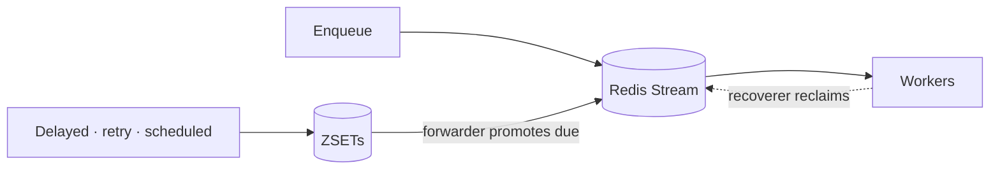

chronos-go splits work into two tracks. Anything ready to run *right now* rides
a Redis Stream with a single consumer group per queue. Anything scheduled for
*later* — delayed tasks, tasks waiting to retry, archived (dead-lettered)
tasks, and completed tasks kept for inspection — lives in sorted sets (ZSETs)
scored by when they're due. A forwarder loop bridges the two: it watches the
ZSETs and promotes entries whose time has come back into the Stream. A
recoverer loop watches the Stream itself for work a crashed worker never
finished. This doc walks through how those pieces fit together and what that
means for how often your handler actually runs.

### The immediate path: Stream + consumer group

Each queue is one Redis Stream with one consumer group. A worker calls
`XREADGROUP` (blocking) to pull the next message, runs your handler against
it, and on success issues `XACK` + `XDEL` to mark it done and remove it. While
a worker holds a message it hasn't acked yet, that message sits in the
consumer group's pending entries list (PEL) — Redis's own record of "this
message was handed out but not yet confirmed done."

### The time-based path: ZSETs + forwarder

A task that isn't ready for the Stream yet — because it was enqueued with
`WithProcessIn`/`WithProcessAt`, because it failed and is waiting out a retry
backoff, because it exhausted its retries and was archived, or because it
succeeded and is being kept around under `WithRetention` — lives in a ZSET
instead, scored by run-at, retry-at, died-at, or completion time depending on
which set it's in. None of that is visible to a worker doing `XREADGROUP`.

The forwarder is what closes that gap: it periodically scans the delayed and
retry ZSETs for entries whose score has already passed, and moves them into
the Stream, where they become an ordinary fetchable message again. From a
worker's point of view, a task that just finished its retry backoff looks
identical to a task that was enqueued a second ago — both simply appear on
the Stream once due.

### Crash recovery: the recoverer

The PEL is also how chronos-go notices a worker that died mid-task: if a
message sits claimed-but-unacked longer than `RecoverMinIdle`, the recoverer
picks it up with `XAUTOCLAIM` and, based on the attempt count already tracked
in the task's hash, either re-queues it for another attempt or sends it to the
dead-letter path — the same path an ordinary exhausted retry takes (see
[Retries & reliability](/docs/retries-and-reliability/)). This is what makes
"the worker that grabbed a task crashed" different from "the task was lost" —
the Stream's PEL remembers it was handed out, and the recoverer is what acts
on that memory.

All three loops — forwarder, recoverer, and the heartbeat that keeps a
long-running task's PEL entry fresh so the recoverer doesn't mistake "still
working" for "crashed" — run automatically once you call
`srv.Start(ctx, mux)`, alongside the fetch loop that does the actual
`XREADGROUP`s. There's nothing extra to wire up.

### Delivery semantics: at-least-once

chronos-go guarantees **at-least-once** delivery: once a task is accepted
onto the queue, your handler will run for it at least one time, but it can
run for it more than once. Two concrete ways that happens:

- **Crash after finishing, before ack.** Your handler returns `nil`, but the
  process dies before the `XACK` + `XDEL` that would record that success.
  From Redis's point of view the message is still claimed and unacked. Once
  `RecoverMinIdle` passes, the recoverer reclaims it and hands it to another
  worker — which runs your handler again for work that, from the caller's
  perspective, already succeeded.
- **Recoverer reclaiming an idle-but-not-dead task.** A worker isn't
  necessarily dead just because it's gone quiet past `RecoverMinIdle` — a
  long GC pause or a slow downstream call looks the same from Redis's side.
  The heartbeat exists precisely to keep genuinely in-progress tasks looking
  alive, but a gap wide enough (or a missed heartbeat) can still let the
  recoverer reclaim and redeliver a task whose original worker is still
  plugging away at it.

Neither case is a bug — it's the shape of the guarantee. The only way to get
*at-most-once* is to risk *at-least-zero* (drop a task rather than risk
redelivering it), and chronos-go, like the Stream/PEL model it's built on,
chooses never to lose one. That's why handlers must be idempotent: design
them so running the same task twice — same upsert, same idempotency key,
same check-then-act — produces the same end state as running it once (see
the idempotency gotchas in [Tasks & handlers](/docs/tasks-and-handlers/) and
[Retries & reliability](/docs/retries-and-reliability/)).

### Gotcha: this doc is for understanding, not an API surface

There's no `chronos.Forwarder` or `chronos.Recoverer` type to construct, and
nothing here adds a call you need to make. Streams, ZSETs, the forwarder, and
the recoverer are what already runs inside `srv.Start(ctx, mux)` — this doc
is a map of that behavior, not a new surface on top of `Mux`, `Client`, and
`Server`. If you want to watch it happen against real Redis, see
[Observability](/docs/observability/) for inspecting queues, streams, and
dead-lettered tasks directly.
