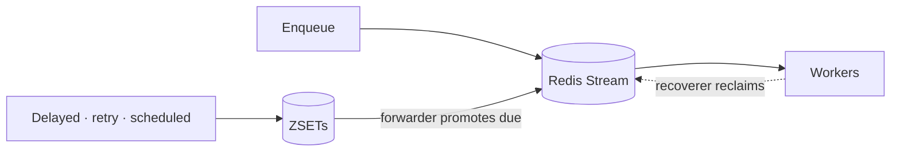

chronos-go는 작업을 두 갈래로 나눕니다. *지금 당장* 실행 가능한 작업은 큐마다
하나씩 있는 컨슈머 그룹을 가진 Redis Stream을 타고 흐릅니다. *나중에* 처리될
작업 — 지연된 태스크, 재시도를 기다리는 태스크, 소진되어 아카이브(데드레터)된
태스크, 그리고 조회를 위해 보관 중인 완료 태스크 — 는 도래 시점을 점수로 갖는
정렬 셋(ZSET)에 머뭅니다. 이 둘을 이어주는 것이 forwarder 루프입니다 —
ZSET을 지켜보다가 시점이 도래한 항목을 다시 Stream으로 밀어 넣습니다.
recoverer 루프는 Stream 자체를 지켜보며, 크래시한 워커가 끝내지 못한 작업을
찾아냅니다. 이 문서는 이 조각들이 어떻게 맞물리는지, 그리고 그것이 여러분의
핸들러가 실제로 몇 번 실행되는지에 어떤 의미를 갖는지를 설명합니다.

### 즉시 처리 경로: Stream + 컨슈머 그룹

각 큐는 하나의 컨슈머 그룹을 가진 하나의 Redis Stream입니다. 워커는
`XREADGROUP`(블로킹)으로 다음 메시지를 가져와 여러분의 핸들러를 실행하고,
성공하면 `XACK` + `XDEL`을 호출해 완료를 표시하고 제거합니다. 워커가 아직
ack하지 않은 메시지를 쥐고 있는 동안, 그 메시지는 컨슈머 그룹의 pending
entries list(PEL)에 남아 있습니다 — "이 메시지는 나눠줬지만 아직 완료
확인은 안 됐다"는 것을 Redis 스스로 기록해 둔 것입니다.

### 나중 처리 경로: ZSET + forwarder

아직 Stream에 오를 준비가 안 된 태스크 — `WithProcessIn`/`WithProcessAt`로
enqueue되어서, 실패해서 재시도 백오프를 기다리는 중이라서, 재시도를 모두
소진해 아카이브되어서, 또는 성공해서 `WithRetention`으로 보관 중이라서 —
는 대신 ZSET에 머뭅니다. 어느 셋에 속하느냐에 따라 run-at, retry-at,
died-at, 또는 완료 시각으로 점수가 매겨집니다. `XREADGROUP`을 호출하는
워커에게는 이 중 아무것도 보이지 않습니다.

이 간극을 메우는 것이 forwarder입니다 — 주기적으로 delayed·retry ZSET을
훑어서 점수(도래 시점)가 이미 지난 항목을 찾아 Stream으로 옮깁니다. 그러면
그 항목은 다시 평범하게 가져올 수 있는 메시지가 됩니다. 워커 입장에서는,
재시도 백오프를 막 끝낸 태스크나 방금 새로 enqueue된 태스크나 도래하는 순간
Stream에 나타난다는 점에서 구분이 없습니다.

### 크래시 복구: recoverer

PEL은 또한 chronos-go가 작업 도중 죽은 워커를 알아채는 방법이기도 합니다 —
메시지가 `RecoverMinIdle`보다 오래 claimed-but-unacked 상태로 남아 있으면,
recoverer가 `XAUTOCLAIM`으로 이를 회수하고, 태스크 해시에 이미 기록된 시도
횟수를 바탕으로 다시 큐에 넣거나 데드레터 경로로 보냅니다 — 이는 일반적인
재시도 소진이 거치는 것과 같은 경로입니다([재시도와 안정성](/ko/docs/retries-and-reliability/)
참고). 이것이 "태스크를 가져간 워커가 죽었다"와 "태스크가 사라졌다"를
다르게 만드는 지점입니다 — Stream의 PEL이 그것이 나눠졌다는 사실을
기억하고 있고, recoverer는 그 기억을 바탕으로 행동합니다.

세 루프 — forwarder, recoverer, 그리고 오래 걸리는 태스크의 PEL 엔트리를
신선하게 유지해서 recoverer가 "여전히 처리 중"을 "크래시"로 착각하지
않도록 하는 heartbeat — 는 모두 `srv.Start(ctx, mux)`를 호출하는 순간부터,
실제 `XREADGROUP`을 수행하는 fetch 루프와 함께 자동으로 실행됩니다. 따로
연결해야 할 것은 없습니다.

### 전달 의미론: at-least-once

chronos-go는 **at-least-once**(최소 한 번 이상) 전달을 보장합니다 —
일단 태스크가 큐에 받아들여지면 여러분의 핸들러는 최소 한 번은 실행되지만,
그 이상 실행될 수도 있습니다. 실제로 그런 일이 벌어지는 두 가지 구체적인
경로가 있습니다.

- **끝낸 후, ack 전에 크래시.** 핸들러가 `nil`을 반환했지만, 그 성공을
  기록할 `XACK` + `XDEL`이 실행되기 전에 프로세스가 죽습니다. Redis
  입장에서는 여전히 그 메시지가 claimed 상태이고 ack되지 않은 것으로
  보입니다. `RecoverMinIdle`이 지나면 recoverer가 이를 회수해 다른
  워커에게 넘기고, 호출자 입장에서는 이미 성공한 작업에 대해 핸들러가
  다시 한 번 실행됩니다.
- **recoverer가 죽지 않은 유휴 태스크를 회수하는 경우.** 워커가
  `RecoverMinIdle`보다 오래 조용하다고 해서 반드시 죽은 것은 아닙니다 —
  긴 GC 정지나 느린 다운스트림 호출도 Redis 쪽에서는 똑같이 보입니다.
  heartbeat는 바로 이런 상황에서 실제로 진행 중인 태스크가 살아 있는
  것처럼 보이게 하려고 존재하지만, 간격이 충분히 벌어지거나 heartbeat를
  놓치면 여전히 recoverer가 원래 워커가 아직 작업 중인 태스크를 회수해서
  다시 전달할 수 있습니다.

두 경우 모두 버그가 아니라 이 보장의 본질적인 형태입니다 —
*at-most-once*를 얻는 유일한 방법은 *at-least-zero*를 감수하는 것(다시
전달하는 대신 태스크를 그냥 버리는 것)뿐이며, chronos-go는 그 바탕이 된
Stream/PEL 모델과 마찬가지로 태스크를 잃어버리지 않는 쪽을 택합니다.
그래서 핸들러는 반드시 멱등이어야 합니다 — 같은 태스크가 두 번 실행되어도
(같은 upsert, 같은 idempotency key, 같은 check-then-act로) 한 번 실행한
것과 같은 최종 상태가 되도록 설계하세요([태스크와 핸들러](/ko/docs/tasks-and-handlers/)와
[재시도와 안정성](/ko/docs/retries-and-reliability/)의 멱등성 관련 주의사항
참고).

### 주의: 이 문서는 이해를 위한 것이지 API 표면이 아닙니다

생성해서 써야 할 `chronos.Forwarder`나 `chronos.Recoverer` 타입 같은 것은
없고, 여기서 새로 호출해야 할 것도 없습니다. Stream, ZSET, forwarder,
recoverer는 이미 `srv.Start(ctx, mux)` 안에서 실행되고 있는 것들이며 — 이
문서는 그 동작을 설명하는 지도일 뿐, `Mux`·`Client`·`Server` 위에 얹히는
새로운 표면이 아닙니다. 실제 Redis에서 이 동작을 직접 관찰하고 싶다면
큐·스트림·데드레터된 태스크를 들여다보는
[관측성](/ko/docs/observability/) 문서를 참고하세요.
